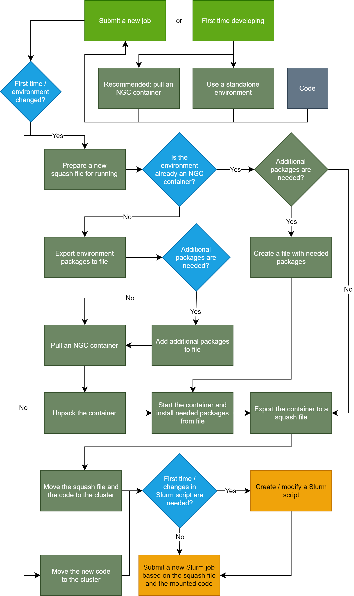

# Pre-Slurm Tutorial

## Introduction

Best practices for preparing your environment to run as a Slurm job. Procedure includes pulling, modifying and converting a container from [NGC](https://catalog.ngc.nvidia.com/) using [NVIDIA Enroot](https://github.com/NVIDIA/enroot). A multi-node [Horovod](https://github.com/horovod/horovod) example is included.

We strongly recommend to work with a container as your neutral environment and mount your code from outside the container.

A flowchart of the process:

[](flowchart.png)

## Episode 1 - Development

Our recommendation is to start developing based on an optimized container from [NGC](https://catalog.ngc.nvidia.com/). Chances are the required packages are installed and no modification is needed. If this is not the case, you can modify the container to fit your requirements.

1. Pull a relevant container from NGC using NVIDIA Enroot.

    Optimized frameworks ([PyTorch](https://catalog.ngc.nvidia.com/orgs/nvidia/containers/pytorch), [TensorFlow](https://catalog.ngc.nvidia.com/orgs/nvidia/containers/tensorflow), etc.) containers are available and updated monthly. To find which container fits your desired environment visit our [Optimized Framework Release Notes](https://docs.nvidia.com/deeplearning/frameworks/#optimized-frameworks-release-notes) and search for the relevant container release.

    Pull command:

    ```bash
    enroot import 'docker://nvcr.io#nvidia/<framework>:<tag>'
    ```

    E.g., to pull a 22.01 release TensorFlow container run:

    ```bash
    enroot import 'docker://nvcr.io#nvidia/tensorflow:22.01-tf1-py3'
    ```

    A container will be pulled and converted to a local [squash](https://en.wikipedia.org/wiki/SquashFS) file.

2. Export the container to Enroot's data path.

    ```bash
    enroot create --name <environment_name> <squash_file>
    ```

    E.g., to export the TensorFlow container run:

    ```bash
    enroot create --name nvidia_tf nvidia+tensorflow+22.01-tf1-py3.sqsh
    ```

    To view all exported containers run:

    ```bash
    enroot list
    ```

3. Start and work on the container.

    ```bash
    enroot start --root --rw --mount <local_folder>:<container_folder> <environment_name>
    ```

    - `--root` enables root privileges.
    - `--rw` enables read and write permissions (any changes inside the container will be saved).
    - `--mount` enables mounting of a local folder (to mount your code and data).

    More configurations are available in Enroot's [start](https://github.com/NVIDIA/enroot/blob/master/doc/cmd/start.md) command documentations.

    To exit the container run `exit`.

## Episode 2 - Exporting your environment to a squash file

Slurm uses squash files to run jobs. Therefore, your environment should be exported to a (new) squash file, containing all the changes you performed (if any).

1. Export your current environment to a squash file.

    ```bash
    enroot export --output <squash_file> <environment_name>
    ```

    A new squash file will be locally created.

    __Note:__ move the squash file to a location accessible to Slurm.

2. __Optional:__ remove old squash files and clear Enroot's data path.

    The original, unmodified squash file can be deleted. Additionally, to delete the exported container under Enroot's data path run:

    ```bash
    enroot remove <environment_name>
    ```

## Episode 3 - Submitting a Slurm job

Slurm jobs can be submitted either via a `srun` or a `sbatch` commands. To submit a job from the "login" node use `sbatch` and prepare a designated script.

### Case A - MPI

Relevant for executing multi-GPU / multi-node runs using MPI. We'll use Horovod's example for that.

__Note:__ also relevant for single-GPU runs, but MPI is redundant.

1. Clone Horovod's repository.

    ```bash
    git clone https://github.com/horovod/horovod
    ```

2. Create a Slurm script file.

    Create a new file, paste the following code and save:

    ```bash
    #!/bin/bash
    #SBATCH --job-name horovod_tf
    #SBATCH --output %x-%j.out
    #SBATCH --error %x-%j.err
    #SBATCH --ntasks 1
    #SBATCH --cpus-per-task 32
    #SBATCH --gpus-per-task 16

    srun --container-image $1 \
    --container-mounts $2:/code \
    --no-container-entrypoint \
    /bin/bash -c \
    "python /code/horovod/examples/tensorflow/tensorflow_synthetic_benchmark.py \
    --batch-size 256"
    ```

    - `%x` - Job name.
    - `%j` - Job ID.

    __Note:__ this script is intended to run on 16 GPUs (E.g., 2 nodes with 8 GPUs each), modify it if needed. Notice how only a single task (`--ntasks 1`) is needed for running with MPI.

3. Submit a new Slurm job.

    ```bash
    sbatch <script_file> <squash_file> <horovods_git_folder>
    ```

    Two files will be locally created, one for the output and one for the errors.

### Case B - OpenMP

Relevant for executing single-GPU / multi-GPU runs in a single / multi-threaded manner with the framework's native support.

Create a Slurm script identical to [Case A](#case-a---mpi), and change the following lines:

```bash
#SBATCH --ntasks <number of GPUs>
#SBATCH --cpus-per-task 8
#SBATCH --gpus-per-task 1
```

This will create a separate task per GPU.
